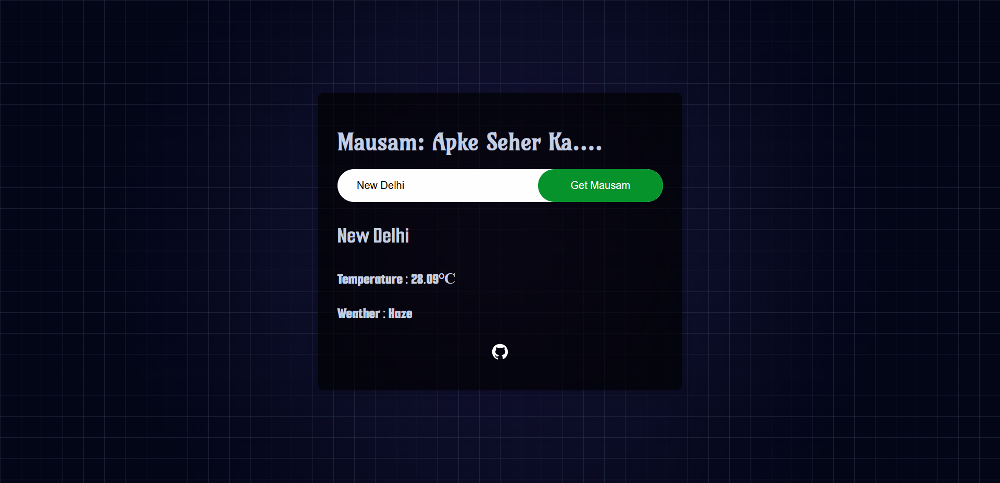

# 🌦️ Modern Weather App

> A beautiful, responsive Weather App built with pure vanilla JavaScript and CSS. Fetches real-time weather data securely using a Vercel serverless function. No frameworks or libraries required.

---

## ✨ Features

- 🔍 Search weather by city name
- 🌡️ Real-time weather data (temperature, humidity, wind, etc.)
- 📱 Responsive design for mobile and desktop
- 🎨 Modern card layout and smooth transitions
- 🖼️ Weather icons and clear status display
- ⚠️ Error handling for invalid locations

## 🖼️ Preview



---

## 🚀 Quick Start

### 1. Clone the Repository
```sh
git clone https://github.com/exceptional007/JS-Learning.git
cd JS-Learning/08_WeatherApp
```

### 2. Project Structure
```
08_WeatherApp/
│   ├── index.html      # Main HTML file
│   ├── styles.css      # Pure CSS styling
│   ├── scripts.js      # App logic (frontend)
│   └── api/
│       └── weather.js  # Vercel serverless function (backend proxy)
└── README.md           # Project documentation
```

### 3. Local Development

#### Option A: Static Preview (Frontend Only)
Open `index.html` directly in your browser. (Weather search will **not** work unless deployed or using Vercel CLI.)

#### Option B: Fullstack Local (with Vercel CLI)
1. Install [Vercel CLI](https://vercel.com/download):
   ```sh
   npm install -g vercel
   ```
2. In project root, run:
   ```sh
   vercel dev
   ```
3. Visit [http://localhost:3000](http://localhost:3000) in your browser.
4. Add your OpenWeatherMap API key as an environment variable:
   ```sh
   vercel env add API_KEY
   ```

---

## 🌐 Deploy to Vercel (Recommended & Secure)

1. **Push your code to GitHub.**
2. **Go to [vercel.com](https://vercel.com/)** and sign up (use GitHub for easy import).
3. **Import your repo** and select the `08_WeatherApp` folder as the project root if needed.
4. **Set Environment Variable:**
   - Go to Project → Settings → Environment Variables
   - Add: `API_KEY = <your_openweathermap_api_key>`
5. **Deploy!**
6. **Visit your Vercel URL** and enjoy your secure weather app.

---

## 🛡️ How API Key is Protected

- The API key is never exposed in frontend code.
- All weather requests go through `/api/weather`, a Vercel serverless function.
- The function uses the API key from Vercel’s environment variables and returns only the weather data to the frontend.

---

## 🎨 Styling

This project uses **pure vanilla CSS** for all styling. No frameworks or external libraries are required. The CSS is written to be clean, maintainable, and modern, with a focus on:

- Flexbox and Grid for layout
- Custom properties for colors and spacing
- Smooth hover and focus effects
- Card-based UI and rounded corners

---

## 🛠️ Customization

You can easily change colors, fonts, or layout by editing `styles.css` to create your own unique look.

---

## 📚 Learning Goals

- Practice DOM manipulation with vanilla JavaScript
- Work with public APIs (fetching weather data)
- Build a modern UI with pure CSS
- Understand responsive design principles
- Improve accessibility and user experience

---

## 🤝 Contributing

Contributions are welcome! If you have ideas for improvements or new features, feel free to open an issue or submit a pull request.

---

## 📄 License

This project is licensed under the MIT License.

---

> Made with ❤️ by exceptional007
